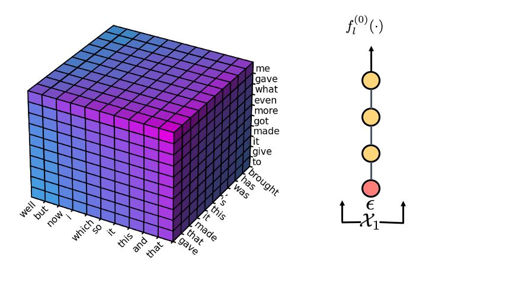

# Cascaded Text Generation with Markov Transformers




Here we provide code to reproduce our results. We provide all training data and training scripts, as well as all pretrained models used in our paper with generation logs. Our code is built on top of [fairseq](https://github.com/pytorch/fairseq) and [pytorch-struct](https://github.com/harvardnlp/pytorch-struct).

## Prerequisites

* [Pytorch](https://pytorch.org/get-started/locally/)

```
pip install -qU git+https://github.com/harvardnlp/pytorch-struct
pip install -qU git+https://github.com/harvardnlp/genbmm
pip install -q matplotlib
pip install -q sacremoses
pip install --editable .
```

## Datasets & Pretrained Models & Logs

We only include `IWSLT14 De-En` in this repository. Other datasets/models can be found at [this link](https://drive.google.com/drive/folders/1G5Vl150cPyc5EWxxqRdngwUifccQeccN?usp=sharing). Data, models, validation and test logs for individual datasets can be found at links below.

* WMT14 En-De Distilled: [data](https://drive.google.com/file/d/1EF9RpYpyuAnDIxxsxiGfG7Y1adTQIUXc/view?usp=sharing) [model](https://drive.google.com/file/d/1VwX6XVvWgGZV_Uq5feINeTcLlQp6pJFR/view?usp=sharing) [val logs](logs_val/wmt14-en-de-distill) [test logs](logs_test/wmt14-en-de-distill) `max-len-a`: 0.9806108887946017, `max-len-b`: 0.8722537432612825
* WMT14 De-En Distilled: [data](https://drive.google.com/file/d/1jkLf_6VZnG358mf2y6e4RTDi54WkChDI/view?usp=sharing) [model](https://drive.google.com/file/d/1BXN6VIbcjqmQjEtnDiTiSeSz000AFkdq/view?usp=sharing) [val logs](logs_val/wmt14-de-en-distill) [test logs](logs_test/wmt14-de-en-distill) `max-len-a`: 0.916756767932658, `max-len-b`: 0.9342969197602784
* WMT16 En-Ro Distilled: [data](https://drive.google.com/file/d/12guRd_-fj15EASfw8gMhfB-JvN29qZjS/view?usp=sharing) [model](https://drive.google.com/file/d/1vUgHKQHbeH06c08BEPoOk-a3EFKF7PpB/view?usp=sharing) [val logs](logs_val/wmt16-en-ro-distill) [test logs](logs_test/wmt16-en-ro-distill) `max-len-a`: 0.9883130097474603, `max-len-b`: 0.9633488906317602
* WMT16 Ro-En Distilled: [data](https://drive.google.com/file/d/1-Qaq3f-bMTdpDpHXXGgGpEIMEALE3o8q/view?usp=sharing) [model](https://drive.google.com/file/d/1j-maWwJ6j9NT3uC_A_4qw2jnL6oW-ntl/view?usp=sharing) [val logs](logs_val/wmt16-ro-en-distill) [test logs](logs_test/wmt16-ro-en-distill) `max-len-a`: 0.9248859339993715, `max-len-b`: 0.8017646630157031
* IWSLT14 De-En Distilled: [data](https://drive.google.com/file/d/1F51UMYW-nHx8nhkX3JR1QVygfQBSoS6F/view?usp=sharing) [model](https://drive.google.com/file/d/19cZ69uQF5PQFaJgdVgn989LT1gm5q5OF/view?usp=sharing) [val logs](logs_val/iwslt14-de-en-distill) [test logs](logs_test/iwslt14-de-en-distill) `max-len-a`: 0.8853894031751983, `max-len-b`: 0.9270677277453601
* WMT14 En-De: [data](https://drive.google.com/file/d/1Wexdn0nBT_0q3Uz6zLoYDvKvoV8wPjdm/view?usp=sharing) [model](https://drive.google.com/file/d/1HFGUzDjNdcgC09wavfA3w0hVD1-zgJmr/view?usp=sharing) [val logs](logs_val/wmt14-en-de) [test logs](logs_test/wmt14-en-de) `max-len-a`: 0.9799950605387177, `max-len-b`: 1.2678756896665853
* WMT14 De-En: [data](https://drive.google.com/file/d/1bSOAPb0xw-zgSaIvsOWzVqOJKzxeG9vz/view?usp=sharing) (same as WMT14 En-De) [model](https://drive.google.com/file/d/1RRKhwLSYFeqTl9Kj-Kko4qaw-Dw8NhkK/view?usp=sharing) [val logs](logs_val/wmt14-de-en) [test logs](logs_test/wmt14-de-en) `max-len-a`: 0.9249639109649428, `max-len-b`: 1.4871392936978083
* WMT16 En-Ro: [data](https://drive.google.com/file/d/1Gl-WVAglCptG7dqrA1VeK8moRlee22T7/view?usp=sharing) [model](https://drive.google.com/file/d/1VV3Mp6MgCneKgMtGAPiq0njuM7expnNV/view?usp=sharing) [val logs](logs_val/wmt16-en-ro) [test logs](logs_test/wmt16-en-ro) `max-len-a`: 0.996921062198531, `max-len-b`: 1.0282739671455445
* WMT16 Ro-En: [data](https://drive.google.com/file/d/1lSvQ86cM_sdTruya2WCTPsQYX4PHC4wo/view?usp=sharing) (same as WMT16 En-Ro) [model](https://drive.google.com/file/d/1EixvleFCNQTceIJFt4OcgeoalSGKKEvq/view?usp=sharing) [val logs](logs_val/wmt16-ro-en) [test logs](logs_test/wmt16-ro-en) `max-len-a`: 0.9247462305812968, `max-len-b`: 1.1175631354616158
* IWSLT14 De-En: [data](https://drive.google.com/file/d/1v7Z-23-U5WV8KhlzrepMVR0J69zH-k0R/view?usp=sharing) [model](https://drive.google.com/file/d/18K-kkSbV_NnXfxeXAjuxvrTb_zGc6r5s/view?usp=sharing) [val logs](logs_val/iwslt14-de-en) [test logs](logs_test/iwslt14-de-en) `max-len-a`: 0.941281036889224, `max-len-b`: 0.8804326732522796

## Usage

### Data Preprocessing

Throughout this Readme, we use `IWSLT14 De-En` as an example to show how to reproduce our results. First, we need to figure out the mapping from source length to target length. We simply use linear regression here: `target_length = max-len-a * source_length + max-len-b`, and we need to estimate `max-len-a` and `max-len-b` from training data. Note that directly using `max-len-a=1` and `max-len-b=0` would still reach reasonable performance.

```
python scripts/get_max_len_ab.py data/iwslt14-de-en/train.de data/iwslt14-de-en/train.en
```

Then we would figure out `max-len-a = 0.941281036889224` and `max-len-b = 0.8804326732522796`.

Before training our model, we need to preprocess the training data using `fairseq-preprocess`.

```
DATASET=iwslt14-de-en
SOURCE_LANG=de
TARGET_LANG=en
TEXT=data/$DATASET
DATA_BIN=data-bin/$DATASET
fairseq-preprocess --source-lang $SOURCE_LANG --target-lang $TARGET_LANG \
    --trainpref $TEXT/train --validpref $TEXT/valid --testpref $TEXT/test \
    --destdir $DATA_BIN \
    --workers 20
```

### Training

```
DATASET=iwslt14-de-en
DATA_BIN=data-bin/$DATASET
SAVE_DIR=checkpoints/$DATASET
ARCH=transformer_iwslt_de_en
DROPOUT=0.3
MAX_TOKENS=4096
LR=5e-4
WARMUP_UPDATES=4000
MAX_UPDATES=120000
WEIGHT_DECAY=0.0001
MAX_LEN_A=0.941281036889224
MAX_LEN_B=0.8804326732522796
CUDA_VISIBLE_DEVICES=0 fairseq-train $DATA_BIN --arch $ARCH --share-decoder-input-output-embed \
    --optimizer adam --adam-betas '(0.9, 0.98)' --clip-norm 0.0 --lr $LR --lr-scheduler inverse_sqrt \
    --warmup-updates $WARMUP_UPDATES --dropout $DROPOUT --weight-decay $WEIGHT_DECAY \
    --criterion label_smoothed_cross_entropy --label-smoothing 0.1 --max-tokens $MAX_TOKENS \
    --eval-bleu --eval-bleu-args '{"max_len_a": '$MAX_LEN_A', "max_len_b": '$MAX_LEN_B'}' \
    --eval-tokenized-bleu --eval-bleu-remove-bpe --eval-bleu-print-samples \
    --best-checkpoint-metric bleu --maximize-best-checkpoint-metric --save-dir $SAVE_DIR \
    --max-update $MAX_UPDATES --validation-max-size 3000 \
    --validation-topk 16 --validation-D 3 --validation-rounds 5 --seed 1234 --ngrams 5
```

We use a single GPU to train on IWSLT14 De-En. After training is done, we can use `checkpoints/iwslt14-de-en/checkpoint_best.pt` for generation.


### Generation

As an example, let's generate from the above trained model. We use `topk = 32` and `rounds = 5`.

```
DATASET=iwslt14-de-en
DATA_BIN=data-bin/$DATASET
SAVE_DIR=checkpoints/$DATASET
BATCH_SIZE=1
TOPK=32
rounds=5
MAX_LEN_A=0.941281036889224
MAX_LEN_B=0.8804326732522796
CUDA_VISIBLE_DEVICES=0 fairseq-generate $DATA_BIN --path $SAVE_DIR/checkpoint_best.pt \
    --batch-size $BATCH_SIZE --topk $TOPK --remove-bpe --D 3 --rounds $rounds \
    --max-len-a $MAX_LEN_A --max-len-b $MAX_LEN_B
```

Note that using a model trained on a different dataset requires re-estimating `max-len-a` and `max-len-b`. Also, we provide another version of max-marginal computation using CUDA kernels based on [tvm](https://github.com/apache/incubator-tvm), which might be slightly faster depending on platform. To use it, install tvm first, then add `--usetvm` to the above command.

### Multi-GPU Generation:

Our approach is amenable to multi-GPU parallelization: we can even get further speedup at batch size 1 using multiple GPUs.

```
NGPUS=3
DATASET=iwslt14-de-en
DATA_BIN=data-bin/$DATASET
SAVE_DIR=checkpoints/$DATASET
TOPK=32
rounds=5
MAX_LEN_A=0.941281036889224
MAX_LEN_B=0.8804326732522796
CUDA_VISIBLE_DEVICES=0,1,2 fairseq-generate $DATA_BIN --path $SAVE_DIR/checkpoint_best.pt \
    --batch-size 1 --topk $TOPK --remove-bpe --D 3 --rounds $rounds --ngpus $NGPUS \
    --max-len-a $MAX_LEN_A --max-len-b $MAX_LEN_B
```

### Visualizations

More visualizations can be found at [analysis/visualizations](analysis/visualizations). To draw these plots (Figure 1, Figure 4 and Figure 5 in the paper), we need more dependencies.

```
pip install -qU git+https://github.com/da03/matplotlib.git
pip install -q mplot3d-dragger
pip install -q tqdm
apt install imagemagick
```

In particular, we need to use a slightly modified version of matplotlib to remove the hard-coded padding for axes.

First, we need to dump the data for visualization purposes by running the generation command with `--dump-vis-path dump_vis_path` (here we use 10 examples from IWSLT14 De-En validation set and `topk=10`):

```
DATASET=iwslt14-de-en
DATA_BIN=data-bin/$DATASET
SAVE_DIR=checkpoints/$DATASET
BATCH_SIZE=1
TOPK=10
rounds=5
MAX_LEN_A=0.941281036889224
MAX_LEN_B=0.8804326732522796
CUDA_VISIBLE_DEVICES=0 fairseq-generate $DATA_BIN --path $SAVE_DIR/checkpoint_best.pt \
    --batch-size $BATCH_SIZE --topk $TOPK --remove-bpe --D 3 --rounds $rounds \
    --max-len-a $MAX_LEN_A --max-len-b $MAX_LEN_B \
    --gen-subset valid --max-size 10 --seed 1234 --dump-vis-path analysis/data/dump_iwslt14_de_en_val_max10_topk10.pt
```

Next, we can use the following command to generate the images and animations:

```
python analysis/plots/visualize_3d.py --dump-vis-path analysis/data/dump_iwslt14_de_en_val_max10_topk10.pt --output-dir analysis/visualizations
```

We can also use the below command to print out constraint sets during decoding:

```
python analysis/plots/print_constraints.py --dump-vis-path analysis/data/dump_iwslt14_de_en_val_max10_topk10.pt --output-dir analysis/visualizations
```

### Training on Other Datasets

#### WMT14 (raw/distilled) En-De/De-En

For preprocessing, we need to use joined dictionary.

```
DATASET=? # dataset dependent
SOURCE_LANG=? # dataset dependent
TARGET_LANG=? # dataset dependent
TEXT=data/$DATASET
DATA_BIN=data-bin/$DATASET
fairseq-preprocess \
    --source-lang $SOURCE_LANG --target-lang $TARGET_LANG \
    --trainpref $TEXT/train --validpref $TEXT/valid --testpref $TEXT/test \
    --destdir $DATA_BIN --thresholdtgt 0 --thresholdsrc 0 \
    --workers 20 --joined-dictionary
```

We train on 3 GPUs.

```
DATASET=? # dataset dependent
MAX_LEN_A=? # dataset dependent
MAX_LEN_B=? # dataset dependent
DATA_BIN=data-bin/$DATASET
SAVE_DIR=checkpoints/$DATASET
ARCH=transformer_wmt_en_de
DROPOUT=0.1
MAX_TOKENS=4096
LR=7e-4
WARMUP_UPDATES=4000
MAX_UPDATES=240000
WEIGHT_DECAY=0.0
CUDA_VISIBLE_DEVICES=0,1,2 python train.py $DATA_BIN --arch $ARCH --share-all-embeddings \
    --optimizer adam --adam-betas '(0.9, 0.98)' --clip-norm 0.0 --lr-scheduler inverse_sqrt --warmup-init-lr 1e-07 \
    --warmup-updates 4000 --lr $LR --min-lr 1e-09 --criterion label_smoothed_cross_entropy --label-smoothing 0.1 \
    --weight-decay $WEIGHT_DECAY --max-tokens $MAX_TOKENS --save-dir $SAVE_DIR --update-freq 3 \
    --no-progress-bar --log-format json --log-interval 50 --save-interval-updates 1000 --dropout $DROPOUT\
    --fp16 --ddp-backend=no_c10d --eval-bleu --eval-bleu-args '{"max_len_a": '$MAX_LEN_A', "max_len_b": '$MAX_LEN_B'}'\
    --eval-tokenized-bleu --eval-bleu-remove-bpe --eval-bleu-print-samples  --best-checkpoint-metric bleu --maximize-best-checkpoint-metric \
    --max-update $MAX_UPDATES  --validation-max-size 3000 --validation-topk 16 --validation-D 3 --validation-rounds 5 --seed 1234
```

#### WMT16 (raw/distilled) En-Ro/Ro-En

For preprocessing, we need to use joined dictionary.

```
DATASET=? # dataset dependent
SOURCE_LANG=? # dataset dependent
TARGET_LANG=? # dataset dependent
TEXT=data/$DATASET
DATA_BIN=data-bin/$DATASET
fairseq-preprocess \
    --source-lang $SOURCE_LANG --target-lang $TARGET_LANG \
    --trainpref $TEXT/train --validpref $TEXT/valid --testpref $TEXT/test \
    --destdir $DATA_BIN --thresholdtgt 0 --thresholdsrc 0 \
    --workers 20 --joined-dictionary
```

We train on 3 GPUs.

```
DATASET=? # dataset dependent
MAX_LEN_A=? # dataset dependent
MAX_LEN_B=? # dataset dependent
DATA_BIN=data-bin/$DATASET
SAVE_DIR=checkpoints/$DATASET
ARCH=transformer_wmt_en_de
DROPOUT=0.3
MAX_TOKENS=5461
LR=7e-4
WARMUP_UPDATES=10000
MAX_UPDATES=120000
WEIGHT_DECAY=0.01
CUDA_VISIBLE_DEVICES=0,1,2 python train.py $DATA_BIN --arch $ARCH --share-all-embeddings \
    --optimizer adam --adam-betas '(0.9, 0.98)' --clip-norm 0.0 --lr-scheduler inverse_sqrt --warmup-init-lr 1e-07 \
    --warmup-updates $WARMUP_UPDATES --lr $LR --min-lr 1e-09 --criterion label_smoothed_cross_entropy --label-smoothing 0.1 \
    --weight-decay $WEIGHT_DECAY --max-tokens $MAX_TOKENS --save-dir $SAVE_DIR --update-freq 1 \
    --no-progress-bar --log-format json --log-interval 50 --save-interval-updates 1000 --dropout $DROPOUT\
    --fp16 --ddp-backend=no_c10d --eval-bleu --eval-bleu-args '{"max_len_a": '$MAX_LEN_A', "max_len_b": '$MAX_LEN_B'}'\
    --eval-tokenized-bleu --eval-bleu-remove-bpe --eval-bleu-print-samples --best-checkpoint-metric bleu --maximize-best-checkpoint-metric \
    --max-update $MAX_UPDATES --validation-max-size 3000 --validation-topk 16 --validation-D 3 --validation-rounds 5 --seed 1234
```


## Citation

```
@inproceedings{NEURIPS2020_01a06836,
 author = {Deng, Yuntian and Rush, Alexander},
 booktitle = {Advances in Neural Information Processing Systems},
 editor = {H. Larochelle and M. Ranzato and R. Hadsell and M.F. Balcan and H. Lin},
 pages = {170--181},
 publisher = {Curran Associates, Inc.},
 title = {Cascaded Text Generation with Markov Transformers},
 url = {https://proceedings.neurips.cc/paper/2020/file/01a0683665f38d8e5e567b3b15ca98bf-Paper.pdf},
 volume = {33},
 year = {2020}
}
```

